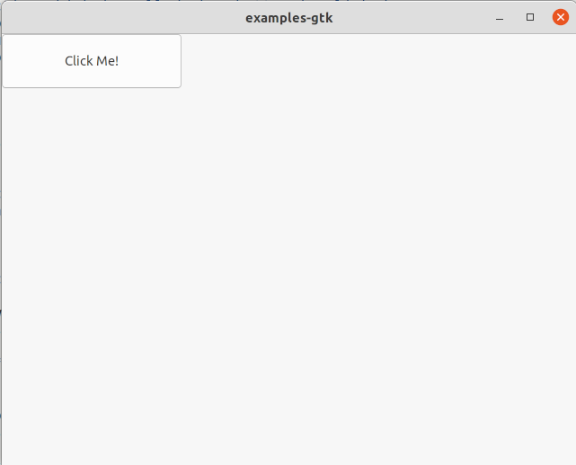

# Status Update

Firstly, what is this thing intended to be today?

> A functional reactive, micro-DSL that makes it super simple to transform data
> into other data. For example, a collection of database query responses -> a
> user experience. But maybe also an API request -> an API response?)

## What did I do yesterday?

Since November 30th of 2020 (a little over a month ago), I've managed to get a
C application to build into 2 target environments (OpenGL and GTK+3).

It's less clear to me that OpenGL is desirable at the moment, but it's nice to
know that I'm able to make a window pop open on my Ubuntu laptop and Ubuntu
workstation.

I also have a super memory-efficient, super-flexible, tree-like DSL getting
described, allocated and freed, which felt nearly impossible for a couple
weeks, but in hindsight, went down pretty quickly. Expecially for someone like
me, who's been so thoroughly spoiled by various garbage collectors for so many
years.

### DSL-ish
So, we have a proof of life for some kind of DSL-ish thing.

Today, it looks something like this:

```JavaScript
Element *root = vbox(
  name("root"),
  width(1024),
  height(768),
  children(
    hbox(name("header")),
    vbox(
      name("body"),
      children(label("Hello World"))
    ),
    hbox(name("footer"))
  )
);
```
> Okay, in the example, I lied about the "label" node, but everything else
> shown there would compile today.

I also have to confess, I've never seen such gorgeous and readable C before!

Can you guess what this does, just by reading it?

The struct(s) that get generated by these macros and function calls,
basically become a tree, they're instantiated leaf-first, which is interesting
to me, and aside from a few administrative fields they only consume memory for
the attributes which are defined, which is also quite interesting to me.

### Valgrind
Valgrind reports that I'm consuming ~3Kb of memory in my test harness today.

Speaking of valgrind, she says I have no memory leaks, which is pretty
exciting!

### CMake
I'm also currently migrating away from my own handcrafted, artisenal Makefile
into CMake. This has not been super fun (at all), but the hype would indicate
that it might still be a good idea. Any advice from hardwon experience would be
appreciated on this front.

For now, one can do CMake-ish things like this:
```bash
mkdir dist && cmake --build dist
make
./dist/bin/cwaybeams-test

```

### GTK+3
I've gotten a window to open with GTK+3, which is (for me at least), a pretty
huge accomplishment! I'm not doing anything useful with it, but I've been able
to get someone else's hello world main app to launch and let me click a button
and change the label. This exposed a ton of work still remaining on my tools,
but it feels really good to see it!

Here's the awesome window:



## What am I doing tomorrow(ish)?

Some things I'm thinking about for next up are:

* Figure out how to update a subtree: In some of my
  [other](https://github.com/lukebayes/nomplate)
  [experiments](https://github.com/waybeams/waybeams), I've used closures and
  lexical scopes to describe the tree, which gave me a pretty good hook for
  updates over time. That doesn't work as well here, what with no closures and
  all. It's entirely possible there might not be sub-tree updates here. Maybe
  you just re-transform the tree whenever there's an interaction or data
  change.
* Actually describe a UI control and render it under GTK+3
* Some kind of data storage story. Probably
  [sqlite](https://sqlite.org/index.html) to start, but possibly
  [Dot Chain](https://github.com/dotchain/dot)?
* Find an efficient way to hash each node as it's processed. This will allow me
  to associate long-lived UI controls with their definitions and avoid
  reconstructing the entire UI with every frame.
* Build into a second UI toolkit, perhaps Windows (shudder) or Android (also
  shudder)? Maybe QT (easier, but less valuable)?

